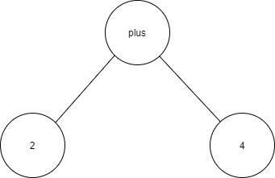
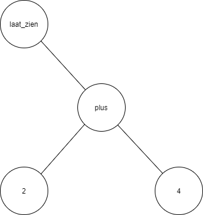

# ATP-interpreter
Deze repo bevat de uitwerking van het ATP practicum jaar 3 TI.
Hieronder zullen een aantal algemene zaken besproken worden zoals de bestands structuur en de stappen die de interpreter zet.<br>
Daarnaast wordt de gemaakte taal toegelicht op basis tabellen met de mogelijke keywords/operators en met stukken voorbeeld code. <br>
Ook wordt uitgelegd hoe de interpreter gestart en gebruikt kan worden.

|Contents|
|-|
|[Bestands structuur](#bestands-structuur)| 
|[interpreter structuur](#interpreter-structuur)|
|[Programeertaal (gerrit--)](#programeertaal-gerrit--)| 
|[How to run](#how-to-run)|

# Bestands structuur
## Bestanden
 - <b>[interpreter.py](interpreter.py) :</b> In deze file staat het interpret gedeelte, dus het doorlopen van de AST en uiteindelijk een output genereren.
 - <b>[lex.py](lex.py) :</b> In deze file staat het lexer gedeelte, het omvormen van de file met text naar bruikbare tokens.
 - <b>[nodes.py](nodes.py) : </b> In deze file staan alle mogelijke nodes van de AST, dit zijn puur classes voor het opslaan van data en hebben alleen een __str__() functie maar geen andere methods.
 - <b>[operators.py](operators.py) :</b> In deze file staan alle operators o.a. voor +,-,= maar ook voor bijvoorbeeld de if en functies om de program state te bewerken.
 - <b>[parser_atp.py](parser_atp.py) :</b> In deze file staan alle functies om te parsen(de token lijst omvormen naar een AST), de file name is parser_atp.py omdat parser.py een build in python functie.
 - <b>[program_state.py](program_state.py) :</b> In deze file staat de class voor mijn program state waarin ik de huidige staat van het programma bij houd zoals bijvoorbeeld het huidige regelnummer en de variabelen.
 - <b>[token_class.py](token_class.py) :</b> In deze file staat de basis token klasse die gebruikt wordt om tokens aan te maken in de lexer.
 - <b>[token_types.py](token_types.py) : </b> In deze file staat een enum met alle verschillende token types zoals een GETAL en een OPERATOR_KEER bijvoorbeeld.

De test.py file en de .txt files zijn voornamelijk voor testen tijdens het maken van het project.

## Mappen:
- <b>test_files</b> Wordt puur gebruikt voor test stukjes code in de programeertaal
- <b>voorbeelden</b> Deze map bevat onder andere de voorbeelden die in deze readme besproken worden.

# Interpreter structuur
## Globale stappen
De gemaakte code wordt in het algemeen via de 4 onderstaande stappen uitgevoerd, de stappen worden per stuk nog extra uitgelegd.
1. [Verwerken argumenten](#Verwerken-argumenten)
2. [Lexen](#Lexen)
3. [Parsen](#Parsen)
4. [Runnen](#Runnen)

### 1.Verwerken argumenten:
Zodra het programma start worde de meegegeven argumenten verwerkt, 1 van de argumenten is de file name deze wordt gebruikt voor het inlezen van de code. Voor uitleg over de argumenten zie [how to run](#how-to-run). Tijdens deze verwerkingsstap worden ook de decorators geassigned op basis van de geselecteerde argumenten. Er zijn 2 decorators zowel voor het lexen als her parsen. <br>
Daarnaast wordt in deze stap ook de stacksize en recursion depth ingesteld. Vervolgens als alle argumenten verwerkt zijn en er geen errors zijn ontstaan gaat het programma verder met de lex stap.

### 2.Lexen:
In deze stap wordt de file ingelezen op basis van de file_name, deze file komt het programma in als 1 grote string. Deze string wordt gesplit op `\n` daarna worden alle onnodige spaties en tabs verwijderd(deze worden gebruikt voor indents). De overgebleven lijsten met strings worden vervolgens nogmaals gesplit naar losse woorden. <br>
Deze woorden worden dan omgezet naar tokens. Deze tokens hebben een type(zoals bijvoorbeeld getal of operator_plus). daarnaast hebben ze ook een value bij een getal is dit het cijfer bijvoorbeeld, bij de operators is dat de functie die bij die operator hoort.

Hieronder een kort voorbeeld:
```c
test wordt 2 plus 3
test2 wordt 10
```
resulteert in de volgende tokens

regel 1:
- (type: NAME , value: test)
- (type: OPERATOR_ASSIGN , value: op_assign)
- (type: GETAL , value: 2)
- (type: OPERATOR_PLUS , value: op_plus)
- (type: GETAL , value: 3)

regel 2:
- (type: NAME , value: test2)
- (type: OPERATOR_ASSIGN , value: op_assign)
- (type: GETAL , value: 10)

### 3.Parsen:
De parse stap maakt van de in de vorige stap gegenereerde tokens een uitvoerbare AST(abstract syntax tree), dit wordt ook weer in een aantal afzonderlijke stappen gedaan welke hieronder beschreven worden.<br>
De AST bestaat uit nodes, er zijn een aantal verschillende nodes, deze zijn te vinden in [nodes.py](nodes.py). Sommige nodes hebben een lhs en/of rhs, hier bevinden zich de "kinderen" van deze node dit zijn ook weer nodes etc.<br>
In eerst in stantie worden alle regels los geparsed, daarna worden alle regels samen genomen om bijvoorbeeld de einde_als en als bij elkaar te voegen.
#### stap 1: regel voor regel parsen
In deze stap wordt elke regel afzonderlijk verwerkt, deze stap returnt dus weer een lijst met nodes, voor elke regel 1 node(met of zonder kinderen).
##### stap 1.1: tokens naar nodes
De eerste stap is om alle tokens om te zetten naar nodes, voor nodes met alleen een waarde, zoals de `getal` en `name` node wordt de waarde van de token meteen in de node gezet. Voor nodes die nog andere nodes als kinderen verwachten wordt een node aangemaakt met een lhs en rhs die op een lege node geinitialiseerd worden. Als de token als value een functie heeft wordt deze in de node opgeslagen als de operator.
##### stap 1.2: verwijderen single sided
Er zijn verschillende operators mogelijk, single sided en doublesided een `plus` is bijvoorbeeld een double sided maar een als of een print is single sided. De verschillende operators vereisen verschillende manieren van parsen vandaar dat de single sided operators eerst verwijderd worden, deze worden wel opgeslagen en later weer toegevoegd.
##### stap 1.3: verwerken double sided operators
Na het verwijderen van de single sided operators worden alle double sided operators verwerkt, dat wordt in de volgorde gedaan zoals aangegeven bij [operators](#operators). Dit wordt gedaan door voor elke prioriteit 1x te parsen.
De parse functie voor operators werkt als volgt:<br>
er wordt gekeken of er zich een operator bevind tussen 2 andere nodes, als dat zo is worden de twee andere nodes toegevoegd als rhs en lhs van de operator node.

<b>Voorbeeld:</b> 2 plus 4<br>
&nbsp;&nbsp;&nbsp;&nbsp; wordt: {lhs: GETAL:2, op: op_plus, rhs: GETAL:4}<br>
&nbsp;&nbsp;&nbsp;&nbsp; De 2 en 4 worden aan de linker en rechterkant van de plus operator geplaatst.

Door dit voor elke prioriteit te doen worden de rekenregels toegepast.<br>
schematische weergave van {lhs: GETAL:2, op: op_plus, rhs: GETAL:4}<br>

##### stap 1.4 toevoegen single sided
Na het verwerken van alle double sided operators worden de single sided operators weer toegevoegd die bij stap 1.1 verwijderd zijn.

##### stap 1.5 verwerken single sided
Na het weer toevoegen van de single sided nodes moeten deze ook verwerkt worden, voor deze nodes geldt dat er maar 1 kind is de rhs. in deze stap worden de bij de eerdere stappen samengevoerde nodes als rhs toegevoegd.<br>
Er zijn 3 single sided operators:
- zolang
- als
- laat_zien

Voor de laat_zien wordt alleen het bovenstaande gedaan, de zolang en als verwachten ook nog een regelnummer voor het bijbehorende einde. Deze waarde wordt in eerst in stantie op None gezet en wordt in stap 2 ingevuld

<b>voorbeeld:</b> laat_zien 2 plus 4<br>
&nbsp;&nbsp;&nbsp;&nbsp; wordt: {print: {lhs: GETAL:2, op: op_plus, rhs: GETAL:4}}<br>
&nbsp;&nbsp;&nbsp;&nbsp; de 2 plus 4 is in stap 1.3 verwerkt en wordt nu als rhs van de print toegevoegd.

Schematische weergave van {print: {lhs: GETAL:2, op: op_plus, rhs: GETAL:4}}<br>


#### stap 2: verwerken alle regels samen 
In deze stap zijn alle regels al geparsed en is er dus een lijst met nodes(1 node voor elke regel) het grootste deel van deze nodes is al ingevuld. Echter is het voor de als en zolang nog iets meer werk. <br>
De mannier hoe ifs en daarme while's verwerkt worden is door de conditite te checken at runtime en dan 1 of meerdere regels verder te gaan in het programma afhankelijk van de conditie. Als de conditie waar is wordt het regelnummer met 1 regel verhoogt en wordt dus de 'body' van de if uitgevoerd. Als de conditie niet waar is wordt het regelnummer verhoogt naar het regelnummer waar de einde_als staat en wordt de 'body' dus overgeslagen.<br>
Voor de zolang(while) geldt hetzelfde behalve dat deze bij de einde zolang weer terug moet naar de bijbehorende zolang.

Dit wordt bereikt door bij elke 'als_node' of 'zolang_node' de bijbehordende 'einde_als' en 'einde_zolang' gezocht dan wordt het verschil in aantal regels tussen beide berekend en opgeslagen in de als/zolang node. Voor de einde zolang geldt hetzelfde maar dan in tegengestelde richting, hier wordt dus het begin gezocht bij de einde node.

Als ook dit aantal regels ingevuld is is het parsen klaar, er is nu een lijst met nodes voor elke regel. Elke regel heeft dus een AST en het hele programma bestaat uit al deze "kleine" AST's. 

<b>Voorbeeld:</b>
```c
laat_zien 2 plus 4
test wordt 10
zolang test kleiner_dan 0
    test wordt test plus 1
    laat_zien test 
einde_zolang
```
<b>Parser output:</b><br>
regel 0: {print: {lhs: GETAL:2, op: op_plus, rhs: GETAL:4}}<br>
regel 1: {lhs: NAME:test, op: op_assign, rhs: GETAL:10}<br>
regel 2: {zolang: conditie: {lhs: NAME:test, op: op_kleiner_dan, rhs: GETAL:0} : einde zolang: 4}<br>
regel 3: {lhs: NAME:test, op: op_assign, rhs: {lhs: NAME:test, op: op_plus, rhs: GETAL:1}}<br>
regel 4: {print: NAME:test}<br>
regel 5: {einde_zolang: hoeveelheid_regels_terug = -3}<br>

### 4.Runnen:
Na het parsen blijft er een gevulde lijst met een "AST" per regel over, om deze vervolgens uit te voeren wordt gebruik gemaakt van een "visit" functie. Deze functie bezoekt als het ware een node in de AST dit gebeurt recursief en de AST wordt dus doorgelopen van boven naar beneden. De getal en name nodes returnen hier hun inhoud(bij de getal node het getal en bij de name node de waarde uit de program state). Tijdens het runnen wordt een program_state bijgehouden, in deze program state staan alle variabelen opgeslagen en het huidige regelnummer. Als een regel voltooid is wordt het regelnummer 1 verhoogt en dus de volgende regel uitgevoerd. Bij de als/zolang wordt het regel nummer aangepast om een deel van de code over te slaan of juist uit te voeren. 

De visit functie returned na het uitvoeren van de hele regel een nieuwe program_state waar het regelnummer in staat wat hierna uitgevoerd moet worden en eventueel wijzigingen in de variabelen.

# Programeertaal (gerrit--) 
## Algemene info
Ik heb er voor gekozen om mijn eigen programeertaal te maken, mijn doel was om een "vernederlandste" versie van C te maken. In de loop van het proces heb ik er meer een combinatie van preprocessor macro's en C van gemaakt in het nederlands. Hieronder staan alle op dit moment mogelijke commando's uitgelegd met ook wat voorbeeldcode. Het is geen volledige vervanger van C zo is het bijvoorbeeld "nog" niet mogelijk om functies te maken. De naam van de taal is "gerrit--" geworden, voornamelijk omdat het door mij bedacht is en nogal vervelend is om in te programeren(vandaar de --).

## Operators
|operator|uitleg|C equivalent|
|-|-|-|
|var1 <b>plus</b> var2| berkent de optelling van de 2 variabeles| var1 + var2|
|var1 <b>min</b> var2| trekt de 2 variabelen van elkaar af| var1 - var2|
|var1 <b>delen_door</b> var2| berkent de deling van de 2 variabeles| var1 / var2|
|var1 <b>keer</b> var2| berkent de vermenigvuldiging van de 2 variabeles| var1 * var2|
|var1 <b>macht</b> var2| berkent var1 tot de macht var2 (var1<sup>var2</sup>) |pow(var1,var2)|
|var1 <b>kleiner_dan</b> var2| geeft 1 als var1 kleiner is dan var2 anders 0| var1 < var2|
|var1 <b>groter_dan</b> var2| geeft 1 als var1 groter is dan var2 anders 0| var1 > var2|
|var1 <b>gelijk_aan</b> var2| geeft 1 als var1 gelijk is aan var2 anders 0| var1 == var2|
|var1 <b>anders_dan</b> var2| geeft 1 als var1 niet gelijk is aan var2 anders 0| var1 != var2|
|var1 <b>groter_gelijk</b> var2| geeft 1 als var1 gelijk is aan of groter is dan var2 anders 0| var1 >= var2|
|var1 <b>kleiner_gelijk</b> var2| geeft 1 als var1 gelijk is aan of kleiner is dan var2 anders 0| var1 <= var2|
|var_name <b>wordt</b> const/expr/var_name| slaat de waarde aan de rechterkant van de <b>wordt</b> op in de gespecificeerde variabele naam| var_name = 1 / var_name = 1 + 2 / var_name = var2|

bij alle operators is het mogelijk om deze te combineren, er wordt rekening gehouden met de rekenregels hieronder een lijst met de prioriteit van de operators. Daarnaast kunnen alle variabeles die aangemaakt zijn binnen het programma gebruikt worden op de plaats van var1/var2 in bovenstaande tabel. Tevens kunnen hier ook constantes staan.

<b>
1. macht
2. delen/vermenigvuldigen
3. plus/min
4. gelijk_aan,groter_dan,kleiner_dan en assignment(wordt)
</b>
Een aantal voorbeelden voor het gebruik van operators.
```c
var1 = 1            //var1 wordt 1
1 + 2               //1 plus 2
var2 = 1 + 2        //var2 wordt 1 plus 2
3 + pow(2,4)        //3 plus 2 macht 4
3 * 5/4 + 10        //3 keer 5 delen_door 4 plus 10
```

## Keywords
|keyword|uitleg|C equivalent|
|-|-|-|
|<b>als_waar</b> conditie|een if statement die kijkt of de conditie waar* is, als dit zo is dan wordt de "body" van de if uitgevoerd anders wordt er gesprongen naar de bijbehorende einde_als. | if |
|<b>einde_als</b>|geeft het einde van een if statement aan| de afsluitende } van een if|
|<b>zolang</b> conditie|een statement die de "body" uitvoert als de conditie waar is, anders wordt er gesprongen naar de bijbehorende einde_zolang | while |
|<b>einde_zolang</b>| geeft het einde van een zolang loop aan en springt terug naar de bijbehorende zolang en kijkt dan weer opnieuw of de loop uitgevoerd wordt of geskipt.|de afsluitende } van een while|
|<b>laat_zien</b>| print de variabele of uitkomst van een expressie die achter de laat_zien staat, het is alleen mogelijk om 1 variabele of 1 uitkomst tegelijk te printen bijvoobeeld laat_zien var1,var2 is niet mogelijk op dit moment. daarnaast kunnen strings geprint worden, dit kan door een sting tussen "" achter de laat_zien te zetten. | printf()|

Hieronder een stukje voorbeeldcode voor het gebruik van als statements en de zolang loop, deze zijn ook te vinden in de map `voorbeelden`.
```c
//if statements
to_print wordt 10                   //to_print = 10
als_waar 10 gelijk_aan to_print     //if(10==to_print){
    laat_zien to_print              //  printf(to_print)
einde_als                           //}
/*
output van dit programma:
    10
*/

//while loops
run wordt 10                //run = 10
start wordt run             //start = run (10)

zolang run                  //while(run){
    laat_zien run           //  prinf(run)
    run wordt run min 1     //  run--
einde_zolang                //}

laat_zien "start waarde"    //printf("start waarde")
laat_zien start             //printf(start)
laat_zien "eind waarde run" //printf("eind waarde run")
laat_zien run               //printf(run)
/*
output van dit programma:
    10
    9
    8
    7
    6
    5
    4
    3
    2
    1
    start waarde
    10
    eind waarde run
    0
*/
```
## Belangrijk
### Getallen
Op dit moment kunnen er alleen maar getallen aangemaakt worden dit kunnen floats of integers zijn, er hoeft niet gespecificeerd te worden welk type het is dit wordt automatisch gedetecteerd. Daarna is het mogelijk om operaties uit te voeren met zowel integers als floats
```c
test_var wordt 10 delen_door 4  //wordt opgeslagen als 2.5
test_var2 wordt 2.5             //wordt opgeslagen als 2.5
test_var3 wordt 10              //wordt opgeslagen als 10
test_var4 wordt -10             //wordt opgeslagen als -10
```
### Variabelen
Variabelen kunnen pas in operators of statements gebruikt worden als deze aangemaakt zijn, de eerste keer dat een variabele naam dus gebruikt wordt moet in combinatie met een <b>wordt</b> operator. Variabelen aanmaken zonder start waarde is niet toegestaan.
Strings kunnen wel opgeslagen worden door de "" tekens te gebruiken er zijn echter geen operaties mogelijk met
```c
//do
var1 wordt 10               //var1 = 10
var2 wordt var1 min 5       //var2 = 5

//don't
var3 wordt var4 min var1    //var4 is nog nooit aangemaakt en kan dus niet gebruikt worden
str wordt "test"            //kan wel opgeslagen worden en geprint maar kunnen geen operaties op gedaan worden
```
### Regels zonder effect
Regels code die geen effect heeft zoals in de voorbeelden hieronder kunnen niet uitgevoerd worden.
Dit komt voornamelijk omdat deze geen effect hebben op het uitvoeren van de code in het algemeen(ze passen de program state niet aan).<br>
Om eventueel deze regels wel te zien kan dit in een `laat_zien` gezet worden.
```c
2 plus 5            //wordt niet uitgevoerd
test wordt 2 plus 5 //wordt wel uitgevoerd
laat_zien 2 plus 5  //wordt uitgevoerd en print 7
```
# How to run
De interpreter kan op verschillende mannieren gerunt worden. Alle mannieren gaan ervaruit dat python(minimaal versie 3.6) in het path staat en aangeroepen kan worden vanuit de commandline. Gezien de recursieve functies en het vele gebruik van de stack wordt bij de start van het programma de stack grote veranderd naar de waardes hieronder.
- linux: <b>2GB</b>
- windows: <b>256MB</b>
De voorkeur gaat uit naar een 32-bit versie van python hier is de memory footprint kleiner en zal het programma minder snel aan de limieten komen.
Voor linux kan het zijn dat voor onderstaande commando's "python3" gebruikt moet worden i.p.v. "python"

De interpreter kan op de volgende mannier gestart worden:<br>
`python interpreter.py file_name`<br>
Hierbij is file_name de naam van het bestand wat geinterpret dient te worden. Alle file extenties zijn op dit moment ondersteund maar het makkelijkste is een standaard ".txt" bestand gezien deze makkelijk te bewerken is.

Om meer informatie te verkrijgen kan de `-v` optie toegevoegd worden aan het commando, door deze flag toe te voegen wordt er meer informatie geprint zoals de parser en lexer output.

Er zijn nog een aantal andere opties die zullen hieronder benoemd worden:
| optie | beschrijving|
|-|-|
|-h | show help messages for all commands|
|-v| run with verbose lexing and parsing|
|-l| run with verbose lexing|
|-p| run with verbose parsing|
|-s| time statistics|

Daarnaast verzorgt de `-h` of `--help` optie een verkorte versie van bovenstaande uitleg.

Het volledige commando kan er dus als volgt uit zien:<br>
`python interpreter.py test_file.txt -v -s`

# Opdracht requirements:
Voor de opdracht moest de taal turing compleet zijn, gezien mijn taal de mogelijkheid heeft om berekeningen te doen, deze op te slaan en if-statements en loops mogelijk zijn zou mijn taal daar aan moeten voldoen.

Daarnaast moest er inheritance verwerkt zijn, dit is de vinden in de [nodes.py](nodes.py) file waar alle nodes afgeleid zijn van een basis node.
verder moesten er minimaal 3 hogere orde functies gebruikt zijn, in zowel de [lexer](lex.py) als de [parser](parser_atp.py) is de `map` functie gebruikt.